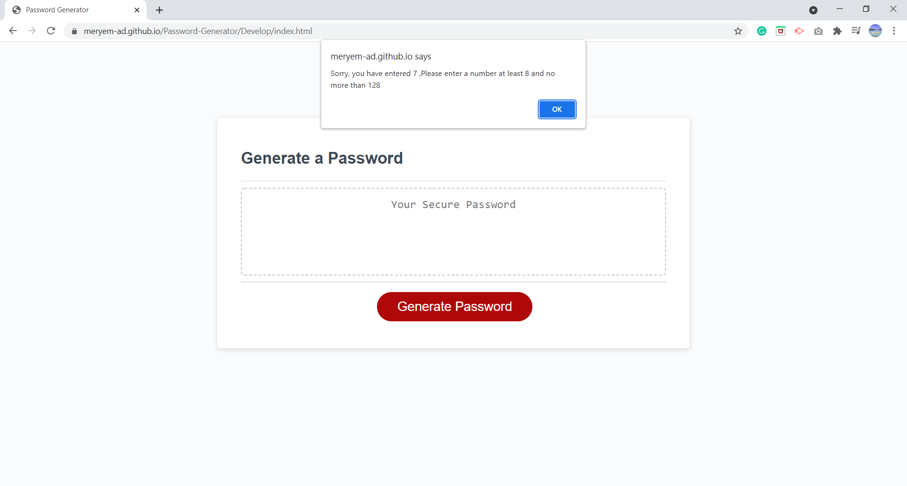
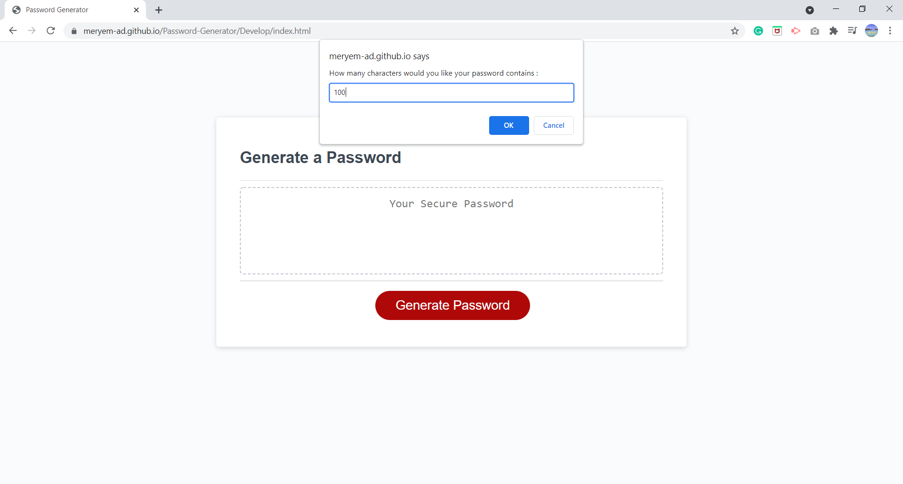
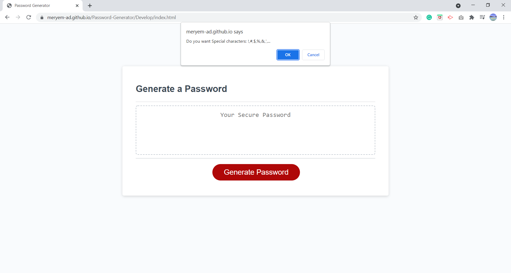

# Password-Generator

Creation of a repository in GitHub:

  * Name of repository: Password Generator

# Starting to Apply the Acceptance Criteria.

 * When the USER click on the button to generate a password THEN a series of questions show up in an alert box;
 * The USER demanded to tap a length number of the password which is at least 8 characters and no more than 128 characters;
 * In case if the USER enters a length number The program re-ask the USER to re-enter a new one and under the condition;
 * The USER confirm which type of character want that the password includes;
 * The password is generated that matches the selected criteria.

# GitBash & GitHub:

* Commit with msg every modification in code.
* Pushing to the repository in GitHub. 

# Application's Screenshoot:
* The program asks the User the enter the password length  

* The program re-ask the user the re-enter another password length at least 8  characters and no more than 128 characters 

* The user taps a validate password length
 

* the program ask the user to confirm the type of character that the password includes;
 
 
 
 

* the program generate the password and display it in the textarea element of the HTML file
 

# Links :

* The URL of the deployed application: https://meryem-ad.github.io/Password-Generator/Develop/index.html
* The URL of the GitHub repository: https://github.com/MERYEM-AD/Password-Generator